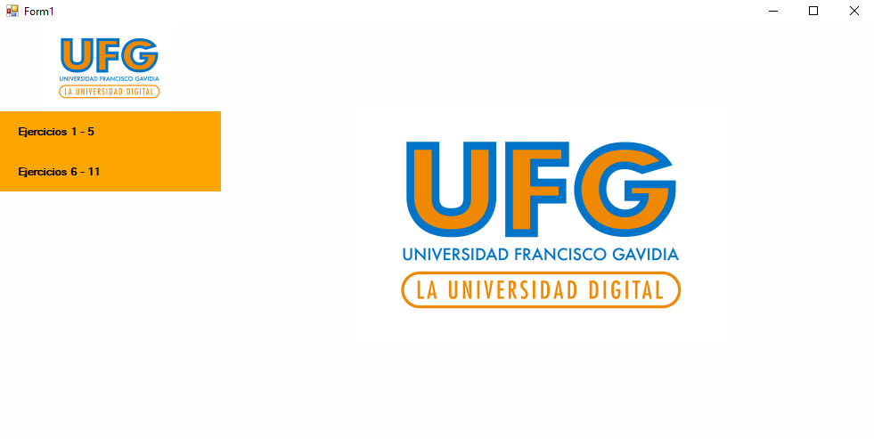

# Tarea Práctica 2: Formularios y Controles

Este repositorio es el resultado de seguir la guía de formularios y controles de la Universidad Francisco Gavidia, bajo la instrucción del profesor Luis Gavidia. El proyecto se enfoca en la creación de diferentes tipos de formularios que incluyen varios tipos de controles en Windows Forms utilizando .NET.

## Descripción del Proyecto

El proyecto se realizó en Visual Studio Community y utiliza Git y GitHub como control de versiones. El objetivo principal es demostrar la comprensión de los conceptos básicos de formularios y controles en Windows Forms, incluyendo:

* Creación de formularios personalizados
* Uso de controles estándar (botones, etiquetas, cuadros de texto, etc.)
* Uso de controles avanzados (grillas, árboles, etc.)
* Manejo de eventos y acciones en los controles  

  
## Tecnologías Utilizadas

* .NET
* Windows Forms
* Visual Studio Community
* Git
* GitHub

## Licencia

Este proyecto está bajo la licencia MIT. Puedes encontrar los detalles de la licencia en el archivo [LICENSE](LICENSE).

## Contenido del Repositorio

* Código fuente del proyecto en C#
* Archivos de configuración de Visual Studio
* Archivos de control de versiones de Git

## Uso y Ejecución

1. Clona el repositorio utilizando Git: `git clone https://github.com/REMR11/TareaPractica2FormulariosYControles.git`
2. Abre el proyecto en Visual Studio Community
3. Compila y ejecuta el proyecto

## Contribuciones

Si deseas contribuir al proyecto, puedes hacerlo de la siguiente manera:

* Realiza un fork del repositorio
* Realiza los cambios deseados
* Envía un pull request con tus cambios

## Agradecimientos

Agradezco al profesor Luis Gavidia por su guía y apoyo en la realización de este proyecto. También agradezco a la Universidad Francisco Gavidia por proporcionar los recursos necesarios para la realización de este proyecto.
